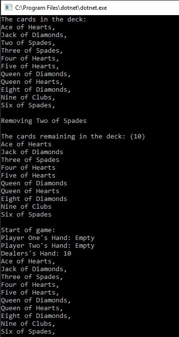
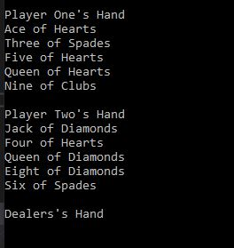
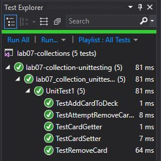

<!-- 
tell them what it is (with context, provide a summary)
show them what it looks like in action (Visuals)
show them how they use it (Step by step directions, “Happy Path” walk through)
	Julie 1-16-19: currently no action from user, it just runs
tell them any other relevant details 
-->

# Lab07-Collections

We are tasked with creating a custom generic collection that is used to simulate a deck of cards.

# Solution
What it looks like in the console if all goes right

Proof tests work

# Collaboration

Tyler Hood helped me with my Card class (mostly that I cannot enum 1 2 3 etc and to spell it out), chatted about enumerator, and helped with how I instatiate my Card class
Amanda Iverson walked us through the remove in class

